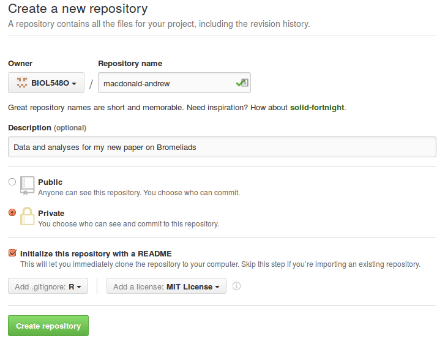

## Content outline

* Let's introduce ourselves to each other (and join the [course github organization](https://github.com/BIOL548O/))
* set up your private repository for your project
    - make a new private repository called `yourlastname_yourfirstname`
    - give it a description
    - choose "Private"
    - under "add .gitignore:" choose *R*
    - under "add a license:" choose *MIT License*
    - click "Create Repository"

