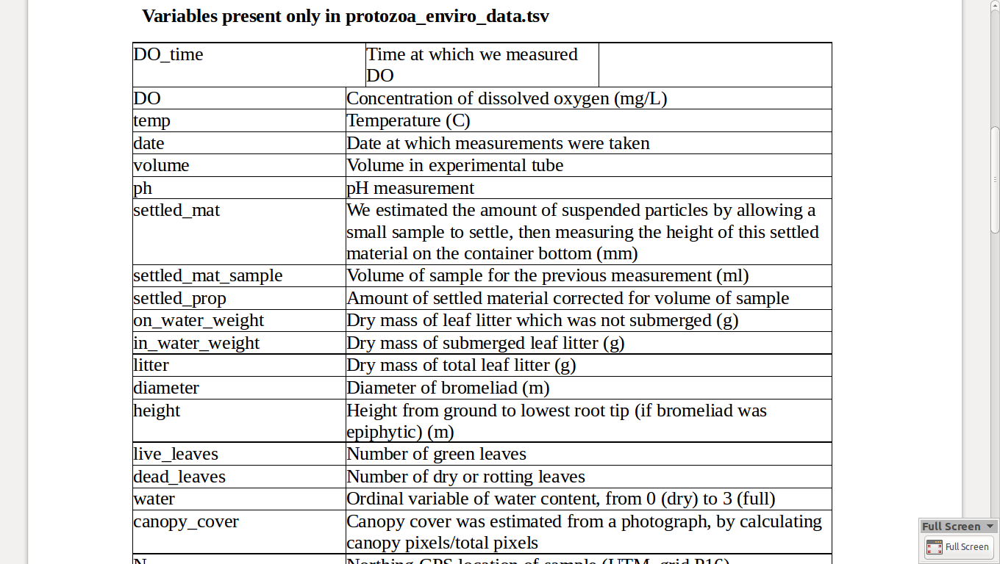

Metadata is _data about data_

We're going to be using some Very Modern Packages in today's exercises. 

```{r}
# install.packages("ghit")
```


```{r}
library(gapminder)
```


## roll your own -- metadata in a csv


```{r}
library(dplyr)

gapminder %>% 
  names %>% 
  data_frame()
```

## get the computer to write it

```{r}
library(rio)

attributes(gapminder)[1:2]

export(gapminder, "gapminder.csvy", format = "csvy", comment_header = FALSE)

head(import("gapminder.csvy"))
```

## the JSON table schema

```
 field     field
   |         |
   |         |
   V         V
 
  A     |    B    |    C    |    D      <--- Row
  ------------------------------------
  valA  |   valB  |  valC   |   valD    <--- Row
  ...

```
 
 We're going to work with **field descriptors**
 
```json
  "name": "name of field (e.g. column name)",
  "title": "A nicer human readable label or title for the field",
  "type": "A string specifying the type",
  "format": "A string specifying a format",
  "description": "A description for the field"
```

## hand-made artisanal metadata

You can also do this simply by writing CSV or simple text with your own hands:

