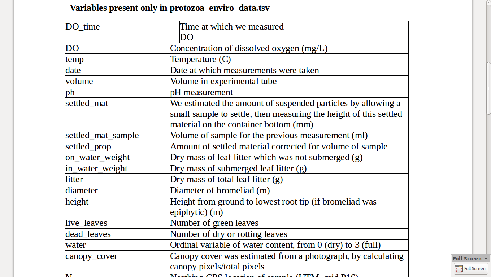

Metadata is *data about data*

We're going to be using some Very Modern Packages in today's exercises.

``` r
# install.packages("ghit")
```

``` r
library(gapminder)
```

roll your own -- metadata in a csv
----------------------------------

``` r
library(dplyr)
```

    ## 
    ## Attaching package: 'dplyr'

    ## The following objects are masked from 'package:stats':
    ## 
    ##     filter, lag

    ## The following objects are masked from 'package:base':
    ## 
    ##     intersect, setdiff, setequal, union

``` r
gapminder %>% 
  names %>% 
  data_frame()
```

    ## Source: local data frame [6 x 1]
    ## 
    ##           .
    ##       (chr)
    ## 1   country
    ## 2 continent
    ## 3      year
    ## 4   lifeExp
    ## 5       pop
    ## 6 gdpPercap

get the computer to write it
----------------------------

``` r
library(rio)

attributes(gapminder)[1:2]
```

    ## $names
    ## [1] "country"   "continent" "year"      "lifeExp"   "pop"       "gdpPercap"
    ## 
    ## $class
    ## [1] "tbl_df"     "tbl"        "data.frame"

``` r
export(gapminder, "gapminder.csvy", format = "csvy", comment_header = FALSE)
```

    ## Warning in write.table(x, file = file, sep = sep, row.names = row.names, :
    ## appending column names to file

``` r
head(import("gapminder.csvy"))
```

    ##       country continent year lifeExp      pop gdpPercap
    ## 1 Afghanistan      Asia 1952  28.801  8425333  779.4453
    ## 2 Afghanistan      Asia 1957  30.332  9240934  820.8530
    ## 3 Afghanistan      Asia 1962  31.997 10267083  853.1007
    ## 4 Afghanistan      Asia 1967  34.020 11537966  836.1971
    ## 5 Afghanistan      Asia 1972  36.088 13079460  739.9811
    ## 6 Afghanistan      Asia 1977  38.438 14880372  786.1134

the JSON table schema
---------------------

     field     field
       |         |
       |         |
       V         V
     
      A     |    B    |    C    |    D      <--- Row
      ------------------------------------
      valA  |   valB  |  valC   |   valD    <--- Row
      ...

We're going to work with **field descriptors**

``` json
  "name": "name of field (e.g. column name)",
  "title": "A nicer human readable label or title for the field",
  "type": "A string specifying the type",
  "format": "A string specifying a format",
  "description": "A description for the field"
```

hand-made artisanal metadata
----------------------------

You can also do this simply by writing CSV or simple text with your own hands:


